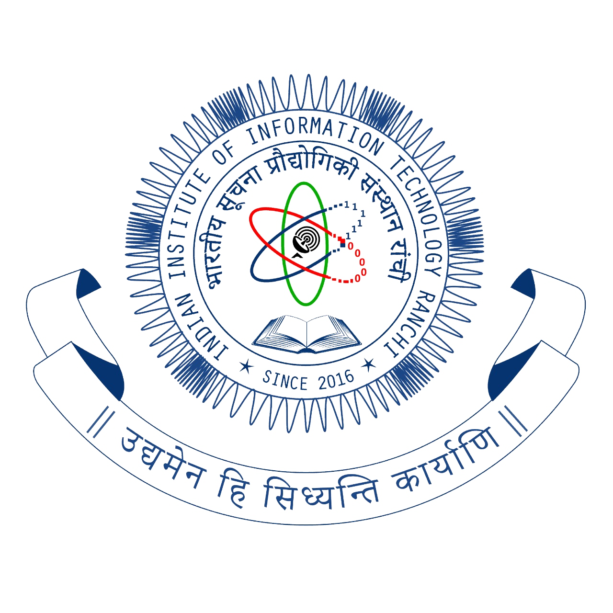

# Compiler Design Lab Record - CS 324

## Introduction

| **Name**         | Shubham Kushwaha                                  |
| :--------------- | :------------------------------------------------ |
| **Roll Number**  | 2019UGCS008R                                      |
| **Subject Code** | CS 324                                            |
| **Faculty**      | Prof. Bhaskar Mondal https://github.com/bhaskarfx |

Lab 1 :

Problem 1.1 - WAP a Lex program to recognize digits.

            Sample Input 1 : 8
            Sample Output : digit

            Sample Input 2: h
            Sample Output : not a digit

Lab 2 :

Problem 2.1 - Lex program to recognize alphabets.

            Sample Input : 4
            Sample Output: not an alphabet

            Sample Input : M
            Sample Output : This contains alphabet

Problem 2.2 - Lex program to recognize digits or letters.

            Sample Input: 7
            Sample Output: This contains digit

            Sample Input : X
            Sample Output : This contains letter

Problem 2.3 - Lex program to recognize whether string contains uppercase, lowercase.

            Sample Input: asd
            Sample Output: contains lowercase letters only

            Sample Input : ASD
            Sample Output: contains uppercase letters only

Lab 3 :

Problem 3.1 - Lex program to count number of characters in the input string.

            Sample Input: Shubham
            Sample Output: Number of charachters found: 7

            Sample Input : 2451TFER112A
            Sample Output : Number of charachters found: 12

Problem 3.2 - Lex program to count vowels, consonants, white spaces and digits.

            Sample Input : Mississippi
            Sample Output : Number of vowels are:  4
                            Number of consonants are: 7
                            Number of digits are: 0
                            Number of white spaces are: 0

Problem 3.3 - Lex program to recognize vowels or consonants.

            Sample Input: E
            Sample Output : vowel

            Sample Input : F
            Sample Output : consonant

Lab 4 :

Problem 4.1 - Lex program to recognize keywords.

            Sample Input: if
            Sample Output : A keyword

            Sample Input : ascd
            Sample Output : Not a keyword

            Sample Input : while
            Sample Output : A keyword

Problem 4.2 - Lex program to recognize identifier.

            Sample Input: auto
            Sample Output: Identifier

            Sample Input: kg212
            Sample Output: identifier

            Sample Input : 235
            Sample Output : not an identifier

Problem 4.3 - Lex program to recognize basic operators (PLUS(+), MINUS(-), GE(>=), LE(<=) ).

            Sample Input: -
            Sample Output: PLUS operator.

            Sample Input: +
            Sample Output: MINUS operator

            Sample Input: &
            Sample Output: invalid operator!

Problem 4.4 - Lex program to recognize float and integers.

            Sample Input: 34
            Sample Output: integer

            Sample Input: 9.6
            Sample Output: Float

            Sample Input: x
            Sample Output: neither integer nor float

Lab 5:

Problem 5.1 - Lex program to count the lexemes.

            Sample Input: int number=46
            Sample Output: No. of lexemes=4

Problem 5.2 - Lex program to verify valid URL or not.

            Sample Input:https://youtube.com
            Sample Output: Invalid URL

            Sample Input: https://www.google.com
            Sample Output: Valid URL

Lab 6:

Problem 6.1 - Lex program to check valid email address.

            Sample Input: shubham2431@gmail.com
            Sample Output: valid

            Sample Input: yahoo.com
            Sample Output: Invalid

Problem 6.2 - Lex program to verify valid phone number.

            Sample Input: +91672367
            Sample Output: Invalid Mobile Number

            Sample Input: +91 8923452367
            Sample Output: Valid Mobile Number

Lab 7:

Problem 7.1: Lex program to count no. of characters, whitespace,tabs and digits in the given input file.

           Sample Input: Compiler
                         Design
                         Lab
                         Work
           Sample Output:Total Characters detected : 27
                         No. of tabs : 0
                         No. of Lines: 5
                         No. of white spaces: 1
                         Other Characters: 21

Problem 7.2: Lex program to count number of lexemes in input file.

           Sample Input: int number= 20+50-70;
           Sample Output: No. of lexemes=9
                          No. of keywords=1
                          No. of identifiers=1
                          No. of integers=3
                          No. of fractions=0
                          No. of operators=4

Lab 8:

Problem 8.1: Sample YACC Program.

              Sample Input: hi
              Sample Output: Hello world

              Sample Input: bye
              Sample Output: Bye world
